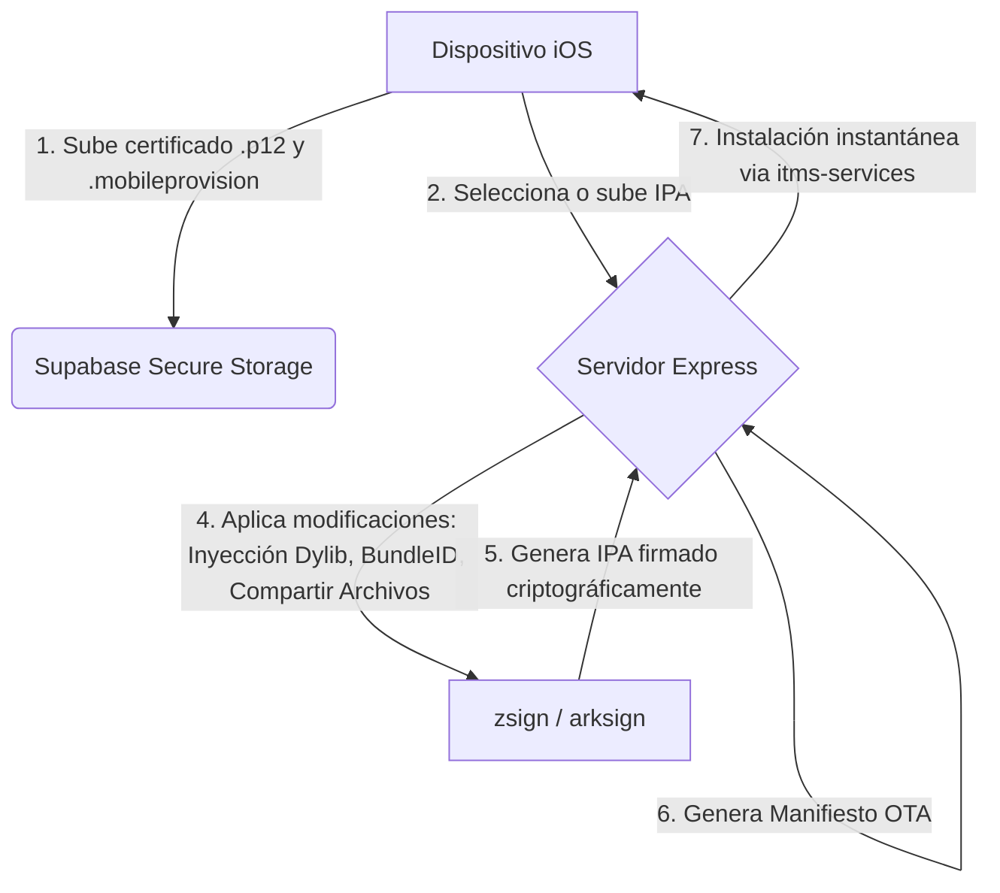

# SpeedySign 📱🔐

[](https://expo.dev/)
[](https://nodejs.org/)
[](https://expressjs.com/)
[](https://supabase.com/)
[](https://www.cloudflare.com/)

> **SpeedySign** es una plataforma Full-Stack (PWA Web + Servidor de Firmas Node.js) que permite firmar e instalar archivos IPA de iOS/iPadOS directamente desde tu dispositivo, sin necesidad de ordenador, de forma rápida, segura y completamente autónoma.

🌐 [speedysign.val3xito.com](https://speedysign.val3xito.com)

---

## 📸 ¿Cómo funciona? (Flujo de Firma)

El ecosistema de SpeedySign se divide en un frontend móvil adaptativo PWA y un backend de alto rendimiento orquestado en Docker:



---

## ✨ Características Principales

* **📦 Gestión de Fuentes (Repositorios)**: Explora catálogos de aplicaciones agregados dinámicamente mediante JSON o importa listados de URLs en lote.
* **🔐 Criptografía y Firma Real**: Orquestación automática de **zsign** y **arksign** en caliente. Permite la conversión de certificados `.p12` modernos a formatos heredados mediante OpenSSL en el servidor.
* **🛡️ Seguridad y Privacidad Blindada**:
  * Almacenamiento seguro temporal de certificados en memoria.
  * Uso de **`secureDelete`** (sobrescritura física de bits en disco antes de eliminar archivos sensibles para evitar recuperación de datos).
  * Limpieza programada automática de IPAs firmados y temporales huérfanos cada 3 minutos.
  * Autenticación anónima por dispositivo con Supabase Auth.
* **⚡ Rendimiento y Web Premium (PWA)**:
  * Compresión Gzip activada en Express.
  * Caché de estáticos inmutable para assets y desactivada para el index/manifest (PWA auto-actualizable).
  * Splash Screen dinámico (con animación de lluvia Matrix en Canvas) integrado con el estado de carga de la app React.
  * Interceptor de enlaces iOS Standalone para evitar que Safari rompa la experiencia de aplicación nativa.

---

## 🛠️ Stack Tecnológico

### Frontend (PWA / Mobile Web)
* **Core:** React Native (Managed Workflow) + Expo Web
* **Estilos:** NativeWind (Tailwind CSS)
* **Navegación:** Expo Router
* **Bases de datos y Auth:** Supabase Client

### Backend (Signing Server)
* **Runtime:** Node.js (TypeScript) + Express
* **Seguridad:** Helmet (con políticas COEP credentialless y CSP configuradas para Supabase y PWA)
* **Herramientas nativas:** zsign, arksign, OpenSSL
* **Base de datos:** Supabase SDK (para auditoría opcional de firmas)

---

## 🚀 Guía de Instalación y Despliegue

### Requisitos Previos
* Node.js v20 o superior
* Docker (opcional para despliegue en un clic)
* OpenSSL instalado en el sistema (requerido para la conversión de certificados)

### 1. Clonar el Repositorio
```bash
git clone https://github.com/val3xito/SpeedySign.git
cd SpeedySign
```

### 2. Configurar Variables de Entorno (`.env` en la raíz)
Crea un archivo `.env` tomando como base `.env.example`:
```env
EXPO_PUBLIC_SUPABASE_URL=https://tu-proyecto.supabase.co
EXPO_PUBLIC_SUPABASE_ANON_KEY=tu-anon-key
EXPO_PUBLIC_SIGNING_SERVER_URL=https://tu-servidor-firmas.com
```

### 3. Ejecutar en Desarrollo (Local)
Instala las dependencias y arranca el entorno de desarrollo concurrente (frontend + servidor):
```bash
npm install
npm run dev
```

### 4. Despliegue en un Clic (Docker / Coolify / Render)
El proyecto incluye un `Dockerfile` optimizado en la raíz. El proceso de construcción de Docker compilará automáticamente **zsign** y **arksign** desde sus fuentes, construirá la aplicación PWA y configurará el servidor de producción.

Solo necesitas conectar tu repositorio a Render o a tu VPS mediante Coolify.

---

## 📄 Términos y Descargo de Responsabilidad

SpeedySign es una herramienta de software independiente creada con fines estrictamente educativos y de experimentación. 
* El software no proporciona, aloja ni distribuye de manera predeterminada ningún tipo de archivo protegido por derechos de autor.
* El usuario final asume la responsabilidad legal exclusiva sobre el origen y validez de los certificados de desarrollo (.p12) y de los archivos de aplicación (.ipa) que procese en la plataforma.
* Las firmas temporales y certificados subidos se procesan bajo protocolos de anonimización absoluta y se destruyen de manera segura y definitiva del disco en un plazo de 3 minutos.
